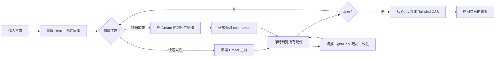
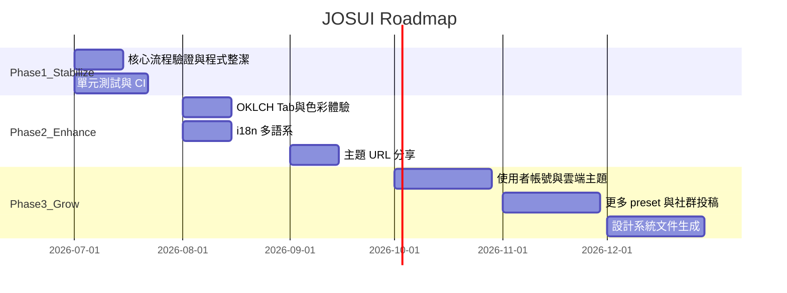

# JOSUI 專案分析

> 視角：資深產品經理 × 技術架構師  
> 版本：v1.0.21 · 最後更新：2026-07-05  
> 線上 Demo：https://josui.space/

---

## 1. 專案概要

### 專案名稱

**JOSUI Official Website**（`@josui/official-website`）

### 專案目標

打造一個面向 shadcn/ui 生態的**即時主題色彩 Playground**，讓使用者能在瀏覽器內完成「調色 → 預覽 → 匯出」的完整閉環，降低設計 token 在設計與開發之間反覆調整的成本。

### 目標使用者

| 族群 | 需求 | 使用場景 |
|------|------|----------|
| **前端工程師** | 快速產出 shadcn/Tailwind 主題設定 | 新專案初始化、主題改版 |
| **UI/UX 設計師** | 視覺化調整配色、確認元件一致性 | 設計稿與實作對齊 |
| **獨立開發者 / Indie Hacker** | 零成本試色、直接複製 CSS | Side project 快速上線 |
| **shadcn/ui 社群使用者** | 參考 preset 主題、學習 token 結構 | 學習與靈感來源 |

### 核心價值

1. **即時性**：透過 CSSOM 直接修改 CSS variables，全頁元件零延遲反映，無需重新編譯。
2. **可匯出**：支援 Tailwind v3 / v4 兩種格式，貼回專案即可使用。
3. **可預覽**：內建 15+ shadcn 元件 demo（Chart、Card、Calendar、Command 等），確保主題在真實 UI 場景下一致。
4. **低門檻**：純瀏覽器操作，無需安裝、無需帳號，打開網站即可使用。

---

## 2. 功能架構

### 目前已有功能

| 模組 | 功能 | 狀態 |
|------|------|------|
| **主題工具列** (`Tool-bar.tsx`) | Create 開關、Copy 匯出、Light/Dark 切換、8 組 preset 主題、border-radius 調整 | ✅ 完成 |
| **色票側欄** (`Theme-color-panel.tsx`) | 列出所有 color token、逐項 ColorPicker 編輯、Portal 滑入、Escape 關閉 | ✅ 完成 |
| **色彩選擇器** (`Color-picker.tsx`) | HEX/RGB/HSL 格式、alpha slider、一鍵複製 | ✅ 完成（OKLCH Tab 未完成） |
| **主題匯出** (`Copy-dialog.tsx`) | Tailwind v4 / v3 CSS 匯出、語法高亮、clipboard | ✅ 完成 |
| **元件展示區** (`sample-card.tsx`) | 15+ demo 卡片（Chart、Form、Tabs、Command 等） | ✅ 完成 |
| **深/淺色模式** (`theme-provider.tsx`) | Light / Dark / System、localStorage 持久化 | ✅ 完成 |
| **全站 Layout** (`Root.tsx`) | Header、Footer、社交連結、Privacy 連結 | ✅ 完成 |
| **隱私權頁** (`Privacy.tsx`) | 靜態法律條款（英文） | ✅ 完成 |
| **404 頁** (`Error.tsx` + `Wava-canvas.tsx`) | Canvas 互動動畫 | ✅ 完成 |
| **SEO / Analytics** (`index.html`, `public/`) | JSON-LD、OG tags、GA、robots.txt、sitemap | ✅ 完成 |

### 尚未完成功能

| 功能 | 現況 | 影響 |
|------|------|------|
| **多語系 (i18n)** | `i18next` 已初始化，但 `useTranslation` 在 Root 被註解，UI 硬編碼英文 | 無法服務中文使用者 |
| **導航選單** | Pricing / Playground / 更多設計 — 整段註解 | Header 僅剩 Logo |
| **使用者系統** | Avatar / Profile / Sign Out — 註解 | 無帳號、無雲端儲存主題 |
| **OKLCH Tab** | Color-picker 內 OKLCH 分頁 UI 被註解 | 與 shadcn v4 OKLCH 方向不一致 |
| **Default 主題重置按鈕** | Tool-bar 內註解 | 使用者需手動選 preset 才能重置 |
| **主題儲存/分享** | 無 | 刷新頁面主題重置（僅 dark/light 偏好保留） |
| **自動化測試** | 無 | 核心色彩邏輯無 regression 保護 |
| **CI/CD** | 無 GitHub Actions | 品質依賴手動 lint + build |

### 使用者操作流程



**典型路徑（約 2–5 分鐘）：**

1. 進入 https://josui.space/
2. 點選 preset（如 blue、rose）快速感受配色
3. 調整 border-radius
4. 點 **Create!** 開啟側欄，微調 `--primary` 等 token
5. 切換 Light/Dark 確認對比
6. 點 **Copy** → 選 v4 或 v3 → 複製 CSS
7. 貼入自己專案的 `globals.css`

### 頁面與模組分工

```
App.tsx (Router)
└── Root.tsx (Layout)
    ├── Header — Logo + 導航（導航已隱藏）
    ├── <Outlet />
    │   ├── Home.tsx — 主 Playground
    │   │   ├── Hero 區塊
    │   │   ├── Tool-bar.tsx — 工具列
    │   │   ├── Theme-color-panel.tsx — 色票側欄 (Portal)
    │   │   └── sample-card.tsx × N — 元件展示 Grid
    │   └── Privacy.tsx — 隱私權
    ├── Footer — 社交連結 + Privacy
    └── Toaster — 全域通知

Error.tsx — 路由錯誤頁（獨立於 Layout）
```

| 層級 | 職責 |
|------|------|
| **Page** | 路由入口、組合 feature components、管理 page-level state |
| **Feature Component** | 業務邏輯（ToolBar、ColorPanel、CopyDialog、ColorPicker） |
| **UI Primitive** | shadcn/Radix 無狀態元件（Button、Dialog、Tabs 等） |
| **Lib** | 純函式工具（CSSOM 操作、色彩轉換、preset 資料） |
| **Layout** | 全站 shell、SEO footer、ScrollToTop |

---

## 3. 技術架構

### 使用的技術棧

| 層級 | 技術 | 版本 |
|------|------|------|
| 框架 | React | 19 |
| 語言 | TypeScript | 5.7 (strict) |
| 建置 | Vite | 6 |
| 樣式 | Tailwind CSS | 4 |
| UI 基礎 | Radix UI + shadcn/ui (new-york) | — |
| 路由 | React Router DOM | 7 |
| 色彩 | colorjs.io + react-colorful | — |
| 圖表 | Recharts | 2.15 |
| 國際化 | i18next + react-i18next | 已 scaffold |
| 品質 | ESLint 9 + Prettier + Stylelint | — |

### 前後端架構

```
┌─────────────────────────────────────────┐
│           Browser (CSR SPA)             │
│  ┌─────────┐  ┌──────────────────┐   │
│  │ React   │  │ CSSOM (Theme Store)│   │
│  │ UI Layer│←→│ document.styleSheets│  │
│  └─────────┘  └──────────────────┘   │
│         ↓ localStorage                  │
│    dark/light preference                │
└─────────────────────────────────────────┘
         ↓ static hosting only
┌─────────────────────────────────────────┐
│  CDN / Static Host (josui.space)        │
│  dist/ — HTML + JS + CSS bundle         │
└─────────────────────────────────────────┘

無後端 · 無資料庫 · 無 API Server
```

**架構特徵：**

- 100% Client-Side Rendering（CSR）
- 主題狀態存在 DOM CSS variables，非 React state
- 唯一持久化：localStorage 的 light/dark 偏好
- 靜態部署，無伺服器運算

### 資料流與 API

**無 REST / GraphQL API。** 資料來源全為靜態：

| 資料 | 來源 | 流向 |
|------|------|------|
| Preset 主題 | `src/lib/color-theme.ts` | ToolBar → CSSOM |
| Design tokens 預設值 | `src/App.css` (:root / .dark) | 頁面載入 → CSSOM |
| 使用者調色 | ColorPicker 輸入 | `style.setProperty()` → CSSOM → 全頁渲染 |
| 匯出字串 | CSSOM 讀取 + colorjs.io 轉換 | CopyDialog → Clipboard |
| Demo 圖表資料 | `sample-card.tsx` hardcode | 靜態渲染 |
| Dark/Light 偏好 | localStorage | ThemeProvider ↔ `<html>` class |

**主題編輯核心資料流：**

```
App.css 定義 token
    ↕ getCSSCustomPropIndex() 讀寫
ToolBar / ThemeColorPanel / ColorPicker 修改
    ↓ var(--token) 全域生效
shadcn 元件即時更新（無 re-render）
    ↓
CopyDialog 讀取 → OKLCH→HSL → 匯出字串
```

### 重要資料夾與檔案說明

```
official-website/
├── index.html              # SEO、GA、AdSense、loading splash
├── vite.config.ts          # Vite 設定（alias、vendor chunk、port 3000）
├── components.json         # shadcn/ui 設定（new-york、slate、cssVariables）
├── package.json            # v1.0.21、Node >=22.12.0
├── release-merge.sh        # 手動 release 流程
├── public/
│   ├── robots.txt          # 爬蟲規則 + sitemap
│   ├── sitemap.xml         # / 和 /privacy
│   └── ads.txt             # AdSense 驗證
└── src/
    ├── main.tsx            # 入口：ThemeProvider + i18n init
    ├── App.tsx             # Router 定義
    ├── App.css             # Tailwind v4 + 完整 design tokens
    ├── layouts/Root.tsx    # 全站 layout
    ├── pages/
    │   ├── Home.tsx        # Playground 主頁
    │   ├── Privacy.tsx     # 隱私權
    │   └── Error.tsx       # 404
    ├── components/
    │   ├── Tool-bar.tsx           # 主題工具列
    │   ├── Theme-color-panel.tsx  # 色票側欄
    │   ├── Color-picker.tsx       # 色彩選擇器
    │   ├── Copy-dialog.tsx        # Tailwind 匯出
    │   ├── theme-provider.tsx     # Light/Dark Context
    │   ├── sample/sample-card.tsx # UI demo 展示
    │   └── ui/                    # 23 個 shadcn 元件
    └── lib/
        ├── get-css-prop.ts   # CSSOM 核心引擎
        ├── color-theme.ts    # 8 組 preset 主題
        └── utils.ts          # cn() helper
```

### 第三方服務與套件

**外部服務（執行時）：**

| 服務 | 用途 | 設定位置 |
|------|------|----------|
| Google Analytics | 流量分析 | `index.html` (G-5FQCLYTTWX) |
| Google AdSense | 廣告（帳號已設定） | `index.html` meta |
| Rybbit Analytics | 主題複製事件追蹤 | `Copy-dialog.tsx`（腳本不在 repo） |
| Google Fonts | Inter + Noto Sans TC | `index.html` |

**關鍵 npm 套件：**

| 套件 | 角色 |
|------|------|
| `@radix-ui/*` | 無障礙 UI primitives |
| `class-variance-authority` | 元件變體（CVA 模式） |
| `colorjs.io` | OKLCH/HSL/RGB 色彩空間轉換 |
| `react-colorful` | 色相/飽和度選取器 |
| `recharts` | 圖表 demo |
| `sonner` | Toast 通知 |
| `cmdk` | Command palette demo |
| `@daypicker/react` | Calendar demo |
| `react-syntax-highlighter` | 匯出 CSS 語法高亮 |
| `vaul` | Drawer 元件 |

---

## 4. 開發流程

### 安裝方式

```bash
# 環境需求
node >= 22.12.0

# 安裝依賴
npm install
```

### 本機啟動方式

```bash
npm run dev
# 開發伺服器：http://localhost:3000
# Vite HMR 即時更新
```

### 測試方式

**目前無自動化測試。**

| 類型 | 現況 | 建議 |
|------|------|------|
| Unit Test | ❌ 無 | 優先測 `get-css-prop.ts` 色彩轉換 |
| Integration Test | ❌ 無 | 測 Copy 匯出字串組裝 |
| E2E Test | ❌ 無 | Playwright 測「改色 → 匯出」流程 |
| Lint | ✅ `npm run lint` | ESLint 9 flat config |
| Type Check | ✅ `tsc -b`（build 時） | strict mode |

**手動測試清單：**

1. 切換 8 組 preset → 確認全頁色彩更新
2. 開啟色票側欄 → 修改 `--primary` → 確認即時反映
3. Copy v4 / v3 → 貼入新專案 → 確認可用
4. 切換 Light/Dark → 確認 token 對應正確
5. Mobile 開啟側欄 → 確認 scroll lock + 關閉動畫

### 建置方式

```bash
npm run build
# 執行 tsc -b（型別檢查）+ vite build
# 輸出至 dist/
```

```bash
npm run preview
# 本地預覽 production build
```

### 部署流程

**目前為手動 Git-flow 式 release：**

```bash
npm run react:release
# 等同於：tsc -b && vite build && ./release-merge.sh
```

`release-merge.sh` 流程：

1. `npm version patch` 自動 bump 版本
2. commit + tag
3. checkout `main` → merge 到 `release` branch
4. `git push --all --tags`
5. 切回 `main`

**推測部署方式：** `release` branch 的 `dist/` 或靜態檔由 hosting 平台（如 Cloudflare Pages / Vercel / GitHub Pages）自動部署。repo 內無 CI/CD workflow 定義。

**上線網域：** josui.space（README）/ josui.design（SEO meta）— 存在雙網域不一致。

---

## 5. 專案規劃

### MVP 範圍（已達成）

- [x] 即時 CSS variable 主題編輯
- [x] 8 組 preset 主題 + border-radius
- [x] Light/Dark 切換
- [x] 色票側欄 + ColorPicker
- [x] Tailwind v3/v4 CSS 匯出
- [x] shadcn 元件展示區
- [x] 響應式布局
- [x] SEO 基礎（meta、sitemap、robots）
- [x] 隱私權頁
- [x] 靜態部署上線

### 優先開發項目

| 優先級 | 項目 | 理由 |
|--------|------|------|
| P0 | 核心流程端到端驗證 | 確保「改色 → 匯出 → 貼入專案」可用 |
| P0 | OKLCH Tab 補齊或清理註解 | 避免程式像半成品 |
| P1 | 程式碼整潔（移除無用註解） | Tool-bar、Home、Color-picker |
| P1 | 統一網域（josui.space vs josui.design） | SEO 與品牌一致性 |
| P2 | 單元測試（色彩轉換核心） | 防止 regression |
| P2 | GitHub Actions CI | build + lint 綠燈 |
| P3 | 啟用 i18n（zh-TW / en） | 擴大使用者群 |
| P3 | ErrorBoundary + useRouteError | 錯誤處理完善 |
| P4 | 主題儲存/分享（URL hash 或 localStorage） | 產品差異化 |
| P4 | 使用者系統 | 需後端，屬下一階段 |

### 技術債與風險

| 技術債 | 嚴重度 | 說明 |
|--------|--------|------|
| 無自動化測試 | 🔴 高 | 色彩轉換邏輯改動無保護網 |
| 無 CI/CD | 🟡 中 | release 依賴手動 shell script |
| i18n scaffold 未啟用 | 🟡 中 | 依賴仍在 bundle 中但無功能 |
| 大量註解程式碼 | 🟡 中 | 導航、Avatar、OKLCH Tab、Default 按鈕 |
| 雙網域不一致 | 🟡 中 | SEO canonical vs 實際上線網域 |
| `window.rybbit` 無 guard | 🟢 低 | 腳本缺失時可能 throw |
| OKLCH 透明度 TODO | 🟢 低 | `get-css-prop.ts` L84 待處理 |
| 無 ErrorBoundary | 🟢 低 | component 錯誤可能白屏 |
| sample-card 外部頭像 | 🟢 低 | randomuser.me 部分 ID 無效 |

| 風險 | 影響 | 緩解 |
|------|------|------|
| CSSOM API 瀏覽器相容性 | 舊瀏覽器可能不支援 | 目標使用者為現代瀏覽器，可接受 |
| 無後端 = 無主題持久化 | 刷新即重置 | MVP 可接受；未來可用 URL state |
| 手動 release 人為錯誤 | 版本/tag 混亂 | 導入 CI/CD |
| AdSense 依賴 | 隱私權合規壓力 | Privacy 頁已涵蓋 |

### 下一階段 Roadmap



**Phase 1 — 穩定化（現在 → 1 個月）**

- 清理技術債、補測試、導入 CI
- 確保核心流程 100% 可靠

**Phase 2 — 體驗強化（1–3 個月）**

- OKLCH 完整支援
- 多語系
- 主題 URL 分享（encode CSS vars to hash）

**Phase 3 — 產品成長（3–6 個月）**

- 使用者系統 + 雲端主題儲存
- 社群 preset 投稿
- 自動生成 design token 文件

---

*相關文件：*

- [技術文件大綱](./technical-outline.md) — 給開發者
- [專案摘要](./project-summary.md) — 給非技術成員
- [待辦清單](./todo.md) — 依優先級排序
